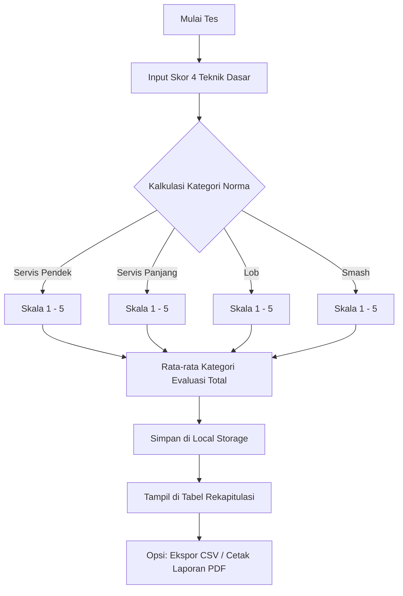

# 🔄 Features & Workflows - SA'BAWA

Dokumen ini mendokumentasikan fitur-fitur fungsional, alur kerja pengguna (Workflow), serta logika rumus konversi skor yang digunakan dalam aplikasi **SA'BAWA**.

---

## 1. 🚶‍♂️ Alur Kerja Pengguna (User Workflow)

### A. Alur Kerja Penguji / Pelatih (Input & Cetak Hasil)
1. **Pilih Menu Form**: Penguji mengklik menu **Isi Data** (baik dari dashboard utama maupun navigasi bawah).
2. **Input Identitas**: Mengisi Nama, NIM/NIS, Gender, Kelas, Tanggal, dan Penguji.
3. **Input Hasil Percobaan**: Penguji memasukkan nilai total (maksimal 100) dari hasil 20x percobaan tes atlet.
4. **Simpan Data**: Data langsung terhitung normanya secara otomatis dan masuk ke tab **Tampil Data**.
5. **Ekspor & Cetak**: Penguji dapat menyaring data berdasarkan kategori atau langsung mencetak laporan (`Cetak Laporan`) / ekspor ke CSV (`Ekspor CSV`).



### B. Alur Kerja Admin (Kelola Konten & Setelan Aplikasi)
1. **Login Admin**: Masuk dengan mengeklik **Login Admin** (Password default: `admin` atau `sabawa2026`).
2. **Dashboard Admin**: Dashboard khusus admin akan terbuka dengan 5 sub-tab:
   - **Data Tes**: Mengedit skor peserta atau menghapus baris data.
   - **Materi Tes**: CRUD panduan teks instruksi pelaksanaan tes.
   - **Video Tutorial**: CRUD link video demonstrasi YouTube.
   - **FAQ**: CRUD daftar tanya jawab seputar instrumen tes.
   - **Setelan App**: Kustomisasi Nama Aplikasi, Subtitle, Deskripsi, dan unggah Logo dinamis.

---

## 2. 🧮 Logika & Rumus Konversi Norma Penilaian

Setiap item tes bulutangkis memiliki ambang batas (*threshold*) skor yang berbeda untuk menentukan klasifikasi norma. Konversi didasarkan pada standar baku norma ilmiah olahraga:

### A. Tes Servis Pendek (Short Serve)
```javascript
if (score > 82.2) return 'Sangat Tinggi';
else if (score >= 67) return 'Tinggi';
else if (score >= 51) return 'Sedang';
else if (score >= 36) return 'Kurang';
else return 'Sangat Kurang';
```

### B. Tes Servis Panjang (Long Serve)
```javascript
if (score > 60) return 'Sangat Tinggi';
else if (score >= 47) return 'Tinggi';
else if (score >= 34) return 'Sedang';
else if (score >= 21) return 'Kurang';
else return 'Sangat Kurang';
```

### C. Tes Pukulan Lob (High Clear)
```javascript
if (score > 91) return 'Sangat Tinggi';
else if (score >= 80) return 'Tinggi';
else if (score >= 70) return 'Sedang';
else if (score >= 59) return 'Kurang';
else return 'Sangat Kurang';
```

### D. Tes Pukulan Smash
```javascript
if (score > 33) return 'Sangat Tinggi';
else if (score >= 25) return 'Tinggi';
else if (score >= 17) return 'Sedang';
else if (score >= 8) return 'Kurang';
else return 'Sangat Kurang';
```

### E. Evaluasi Total (Overall Category)
Untuk menentukan kesimpulan evaluasi keseluruhan dari keempat tes tersebut:
1. Setiap kategori dikonversi menjadi angka:
   - **Sangat Tinggi** = 5
   - **Tinggi** = 4
   - **Sedang** = 3
   - **Kurang** = 2
   - **Sangat Kurang** = 1
2. Rata-rata dari nilai numerik yang terkumpul dihitung:
   - `avg >= 4.5` ➡️ **Sangat Tinggi**
   - `avg >= 3.5` ➡️ **Tinggi**
   - `avg >= 2.5` ➡️ **Sedang**
   - `avg >= 1.5` ➡️ **Kurang**
   - `avg < 1.5` ➡️ **Sangat Kurang**
