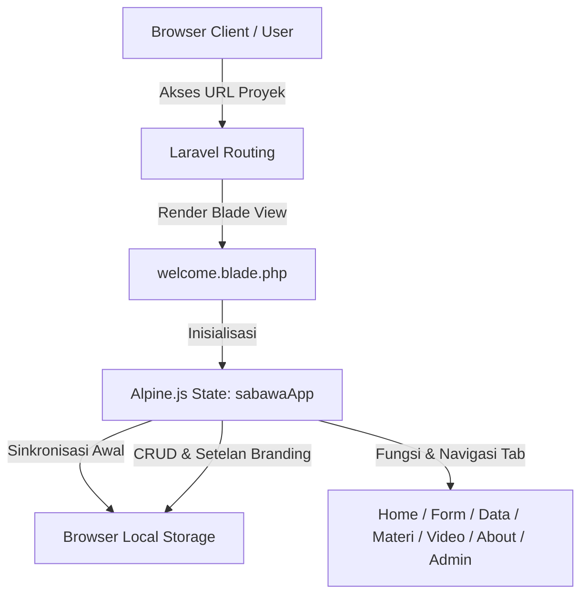

# 🏸 Project Overview - SA'BAWA

Aplikasi **SA'BAWA** (*Silvi Aryanti' Badminton Assessment WebApp*) adalah sistem informasi berbasis web yang dirancang khusus untuk digitalisasi, pengolahan, dan otomatisasi nilai tes 4 teknik dasar bulutangkis berdasarkan norma penilaian ilmiah.

Dokumen ini menjelaskan latar belakang, arsitektur sistem, teknologi pendukung, dan tujuan strategis proyek untuk dijadikan referensi blueprint proyek serupa di masa mendatang.

---

## 🎯 Tujuan Utama Proyek
1. **Otomatisasi Norma Penilaian**: Mengurangi kesalahan rekap manual dengan menghitung secara instan skala norma (Sangat Tinggi, Tinggi, Sedang, Kurang, Sangat Kurang) dari 4 jenis tes bulutangkis.
2. **Offline-First & Local Storage Persistence**: Membantu pengguna (pelatih/penguji) di lapangan agar data tetap tersimpan aman di browser local storage, bahkan saat koneksi internet tidak stabil.
3. **Responsive Dual-Mode UI/UX**: Memberikan pengalaman aplikasi Android native saat dibuka di HP/Tablet, namun tetap fungsional sebagai media presentasi informatif di layar Desktop.
4. **Dashboard CMS Dinamis**: Memudahkan admin atau peneliti untuk melakukan kustomisasi konten (materi, video, profil peneliti, nama instansi) langsung dari antarmuka web.

---

## 💻 Tech Stack (Teknologi yang Digunakan)

### Backend & Database Scaffold
- **Framework**: Laravel 11 (PHP 8.2+)
- **Database**: SQLite (Ringan, tanpa konfigurasi database server rumit, cocok untuk cPanel/shared hosting kecil)
- **Commands & Caching**: Artisan CLI untuk manajemen database migrasi dan pembersihan cache.

### Frontend & UI/UX
- **Markup & Layout**: Blade Template Engine (Laravel)
- **Styling Framework**: Tailwind CSS (Utility-first CSS framework untuk tampilan modern dan responsif)
- **State Management**: Alpine.js (Ringan, reaktif, sangat cepat dimuat tanpa overhead framework besar seperti React/Vue)
- **Icons**: FontAwesome 6 (Solid & Regular icon kit)
- **Pop-up / Dialogs**: SweetAlert2 (Untuk dialog notifikasi, sukses simpan, dan konfirmasi hapus data yang estetik)

---

## 🏗️ Konsep Arsitektur Sistem

Aplikasi ini menggunakan perpaduan arsitektur **Hybrid SPA (Single Page Application)**:

### 1. Client-Side State & Persistence
- Halaman web utama dilayani sebagai satu halaman Blade template (`welcome.blade.php`) untuk menjaga keringanannya (*single-page feel*).
- Seluruh data penilaian atlet, konfigurasi nama aplikasi, video tutorial, FAQ, dan data peneliti disimpan di **Local Storage Browser** untuk performa instan tanpa latency request HTTP.

### 2. Backend Database Scaffold
- Disediakan migrasi tabel SQLite (`database.sqlite`) untuk kebutuhan pengembangan masa depan jika ingin beralih sepenuhnya ke sinkronisasi database server online berbasis API.

### 3. Responsive Frame Layout
- Di desktop, aplikasi menampilkan layout panel ganda: presentasi riset di kiri, simulasi antarmuka handphone di kanan.
- Di mobile/tablet, frame simulasi hilang secara otomatis dan bertransformasi menjadi aplikasi layar penuh dengan navigasi bar bawah (*Fixed Bottom Navigation*).
